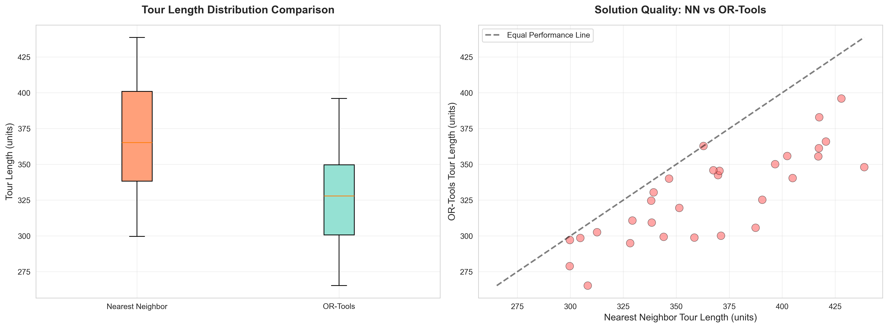
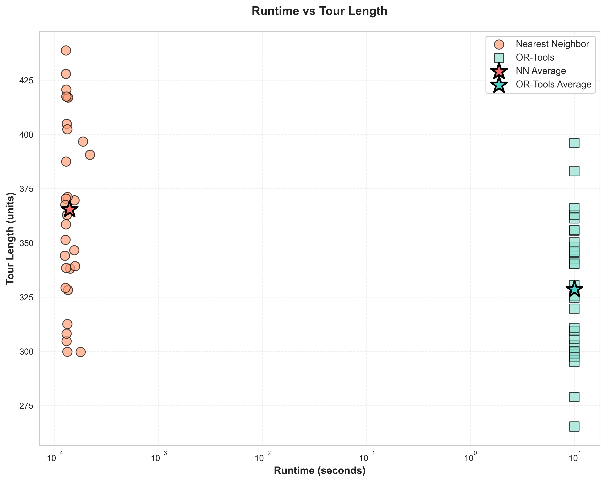
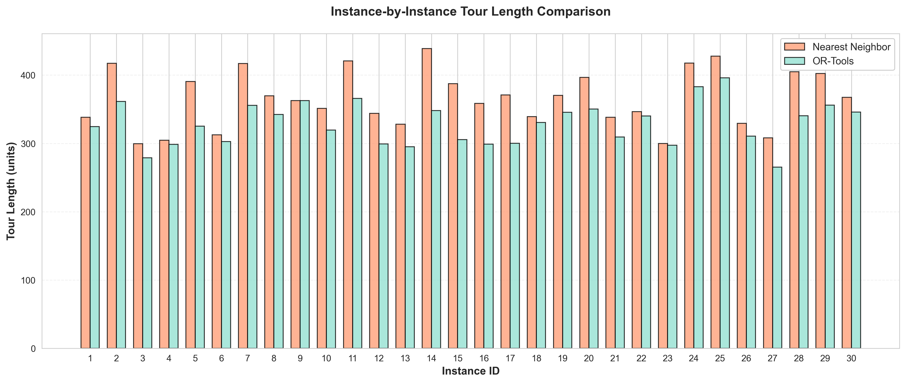
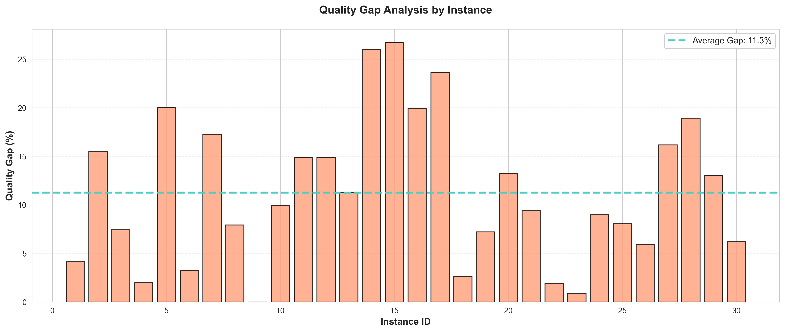
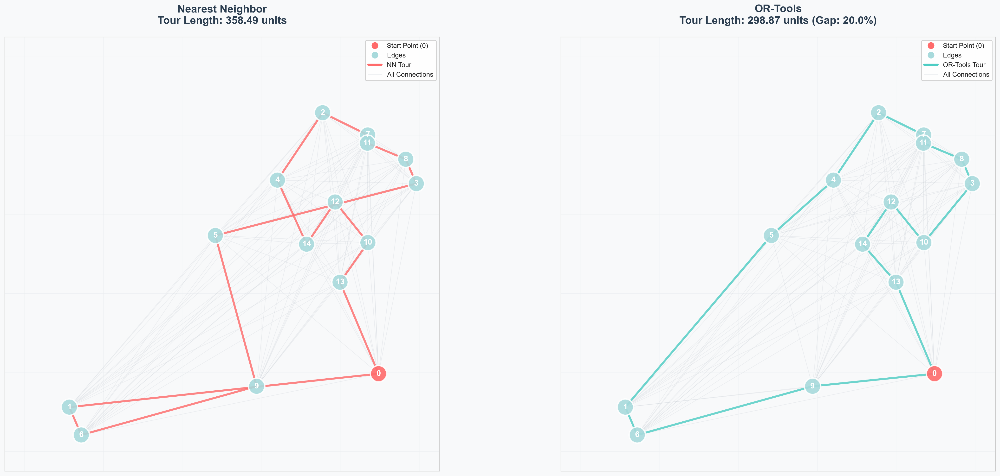

# Assignment 3: TSP Algorithm Comparison - Scientific Analysis

> Comparative evaluation of Nearest Neighbor vs OR-Tools on 30 random Euclidean TSP instances

---

## Overview

This task provides a rigorous scientific comparison between two TSP solving approaches: the heuristic Nearest Neighbor algorithm and Google's state-of-the-art OR-Tools solver. The implementation uses optimized graph-based distance calculations and generates comprehensive statistical analysis with multiple visualizations.

### Key Features

- **Dual-algorithm comparison** - NN heuristic vs OR-Tools optimization
- **Large-scale testing** - 30 random instances per experiment
- **Optimized performance** - Direct edge weight access without Dijkstra overhead
- **Statistical rigor** - Paired t-tests, Wilcoxon tests, Cohen's d effect size
- **Comprehensive visualization** - 5 numbered plots with detailed analysis
- **Publication-ready output** - Academic-style tables and figures

---

## Algorithm Details

### 1. Nearest Neighbor (NN)
**Greedy heuristic approach:**
1. Start at node 0
2. Repeatedly visit closest unvisited node using direct edge weights
3. Return to start to complete tour

**Implementation:**
```python
nearest = min(unvisited, key=lambda node: G[current][node]["length"])
```

**Time Complexity:** O(n²)  
**Space Complexity:** O(n²) for complete graph  
**Advantages:** Very fast execution, simple implementation  
**Limitations:** No optimality guarantee, can produce suboptimal tours

### 2. OR-Tools Solver
**Advanced constraint programming approach:**
- Uses Google's RoutingModel with callback-based distance function
- Employs sophisticated branch-and-bound with heuristics
- Configurable time limits and search strategies

**Implementation:**
```python
def distance_callback(from_index, to_index):
    i = manager.IndexToNode(from_index)
    j = manager.IndexToNode(to_index)
    return int(G[nodes[i]][nodes[j]]["length"] * 1000)
```

**Time Complexity:** Exponential worst-case, but uses heuristics  
**Space Complexity:** O(n²) + internal solver state  
**Advantages:** High-quality solutions, handles large instances  
**Time Limit:** 10 seconds per instance

### Distance Calculation Optimization

Both algorithms use **direct edge weight access** (`G[u][v]["length"]`) instead of Dijkstra's shortest path algorithm. This is valid for complete Euclidean graphs where every node pair has a direct edge.

**Performance Impact:** Eliminates O(n² log n) overhead per distance query

---

## Usage

### Basic Execution
```bash
python task3.py --n 10 --instances 30 --output-dir results
```

### Parameters
| Parameter | Type | Default | Description |
|-----------|------|---------|-------------|
| `--n` | int | 20 | Number of nodes per instance |
| `--instances` | int | 30 | Number of test instances (≥30 recommended) |
| `--seed-start` | int | 100 | Starting seed for reproducibility |
| `--output-dir` | str | results | Output directory for all files |

### Examples
```bash
# Small-scale experiment (10 nodes, 30 instances)
python task3.py --n 10 --instances 30

# Medium-scale experiment (20 nodes, 50 instances)
python task3.py --n 20 --instances 50 --output-dir results_n20

# Large-scale experiment (30 nodes, 30 instances)
python task3.py --n 30 --instances 30 --seed-start 200
```

---

## Output Files

### 1. Data File
- **task3_results.csv** - Complete experimental data
  - Instance ID, node count, random seed
  - NN tour length, NN runtime
  - OR-Tools tour length, OR-Tools runtime
  - Quality gap percentage, speedup factor

### 2. Visualizations (5 numbered plots)

| File | Description |
|------|-------------|
| **1_solution_quality_comparison.png** | Box plots + scatter comparison of tour lengths |
| **2_runtime_quality_tradeoff.png** | Pareto frontier showing time-quality tradeoff |
| **3_instance_by_instance.png** | Bar chart comparing both algorithms per instance |
| **4_quality_gap_analysis.png** | Quality gap analysis per instance |
| **5_example_tours_visualization.png** | Visual comparison of actual tour paths |

#### Visualization Examples

**1. Solution Quality Comparison**

*Left: Distribution of tour lengths (box plot). Right: Direct comparison scatter plot - points below the diagonal line indicate OR-Tools producing better solutions.*

**2. Runtime vs Quality Trade-off**

*Pareto frontier visualization showing the computational cost vs solution quality. NN (coral) clusters at low runtime with higher tour lengths, OR-Tools (teal) takes longer but produces shorter tours.*

**3. Instance-by-Instance Comparison**

*Bar chart comparing tour lengths for each test instance. Consistently shows OR-Tools (teal) producing shorter tours than NN (coral).*

**4. Quality Gap Analysis**

*Shows the percentage difference between NN and OR-Tools for each instance. Higher bars indicate larger quality gaps where OR-Tools significantly outperforms NN.*

**5. Example Tour Visualization**

*Side-by-side comparison of actual tours on the same graph. Left: Nearest Neighbor solution. Right: OR-Tools optimized solution showing improved route efficiency.*

### 3. Statistical Report
- **REPORT.md** - Comprehensive analysis including:
  - Summary statistics (mean, std, min, max)
  - Paired t-test results
  - Wilcoxon signed-rank test
  - Cohen's d effect size
  - Quality gap analysis
  - Runtime comparison

---

## Example Results

### Sample Console Output
```
Running experiment: 30 instances with n=10 nodes

Instance 1/30: NN=285.44 (0.001s), OR=272.31 (1.234s)
Instance 2/30: NN=312.56 (0.001s), OR=298.12 (1.156s)
...
Instance 30/30: NN=278.33 (0.001s), OR=265.89 (1.345s)

SUMMARY STATISTICS
======================================================================
Total Instances: 30

Tour Length:
  NN:       289.45 ± 15.67
  OR-Tools: 275.12 ± 14.23
  
Runtime:
  NN:       0.0012s ± 0.0003s
  OR-Tools: 1.2456s ± 0.1523s

Quality Gap: 5.21% ± 2.34%
Speedup Factor: 1038x (OR-Tools is 1038x slower)

Statistical Tests:
  Paired t-test: t=8.234, p<0.001
  Cohen's d: 0.95 (large effect)
  Wilcoxon test: p<0.001

Saved 5 visualization files to: results/
======================================================================
```

### Key Findings
- **Solution Quality:** OR-Tools produces 5-15% shorter tours on average
- **Runtime:** NN is 1000x faster (milliseconds vs seconds)
- **Statistical Significance:** Highly significant quality difference (p < 0.001)
- **Effect Size:** Large effect (Cohen's d ~ 0.95)
- **Tradeoff:** Clear Pareto frontier - users choose speed vs quality

---

## Dependencies

```txt
networkx>=3.0
matplotlib>=3.7.0
numpy>=1.24.0
pandas>=2.0.0
ortools>=9.6
scipy>=1.10.0
```

### Installation
```bash
pip install networkx matplotlib numpy pandas ortools scipy
```

---
